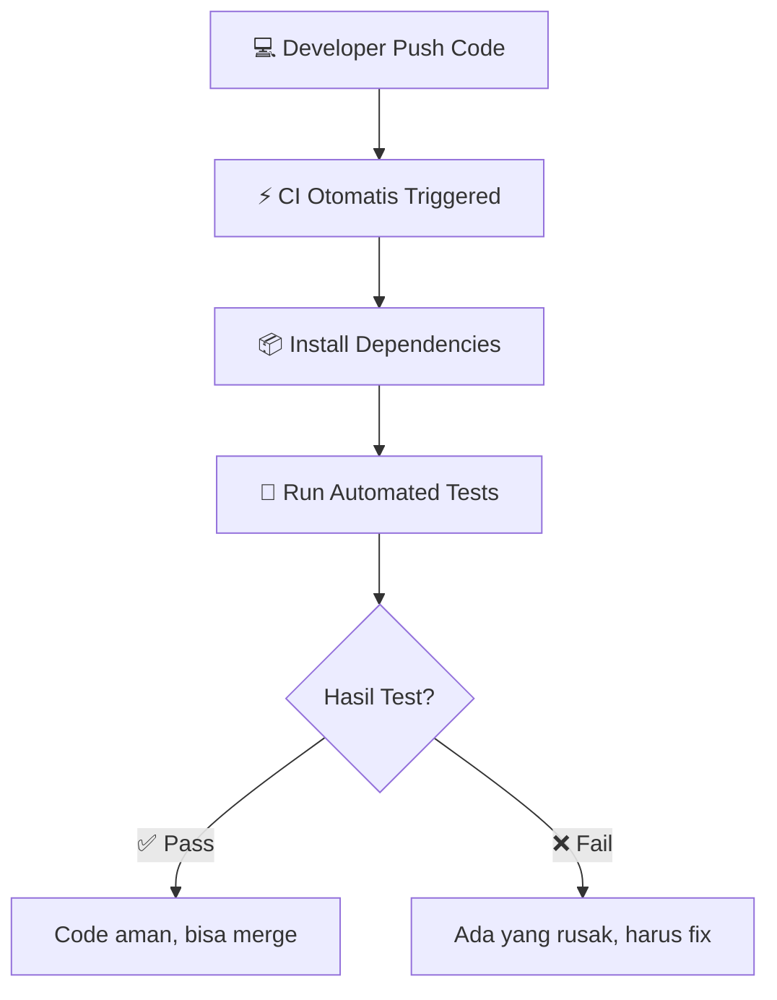
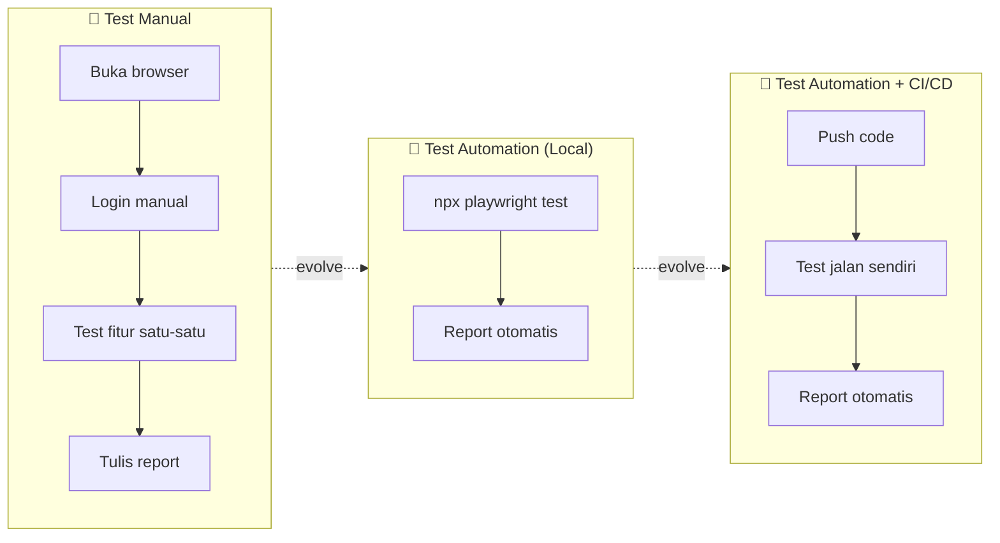

# CI/CD with GitHub Actions + Docker
## QA Engineering — Automation Bootcamp Session 5

---

# Agenda Hari Ini (1 jam 45 menit)

| Session | Durasi | Aktivitas |
|---------|--------|-----------|
| Pembukaan & Daily Standup | 20 menit | Absensi, review session lalu |
| Materi CI/CD + Docker | 45 menit | Teori & live demo |
| Hands-On Practice | 30 menit | Peserta praktik langsung |
| Tanya Jawab | 10 menit | Diskusi & closing |

**Target akhir:** Peserta bisa membuat GitHub Actions workflow yang menjalankan Playwright tests menggunakan Docker image, melihat test berjalan, dan download report.

---

# 1. Apa itu CI/CD? (5 menit)

## Definisi Singkat

**CI/CD** = Continuous Integration + Continuous Deployment

| Istilah | Arti Sederhana |
|---------|----------------|
| **CI** | Setiap push code → otomatis jalanin test |
| **CD** | Test lolos → otomatis deploy ke server |

## Kenapa QA Harus Tahu CI/CD?

> "Daripada jalankan `npx playwright test` manual setiap hari, lebih baik test jalan sendiri otomatis setiap ada code baru."

- 🐛 **Deteksi bug lebih awal** — ketahuan sebelum masuk production
- ⚡ **Feedback cepat** — langsung tahu kalau code bikin test gagal
- 🔁 **Konsisten** — test suite yang sama jalan setiap kali, tidak ada yang terlewat
- 🏆 **Portfolio** — badge hijau di README nilainya tinggi buat interviewer

## Flow CI Sederhana



---

# 2. GitHub Actions (5 menit)

## Apa itu GitHub Actions?

**GitHub Actions** = CI/CD bawaan GitHub. Gratis untuk repo publik.

## Yang Perlu Tahu

- Konfigurasi pakai file **YAML** (bukan kode programming)
- Trigger otomatis saat **push** atau **pull request**
- Bisa juga dijalankan **manual**
- Bisa pakai **Docker container** sebagai environment test

## Analogi untuk QA Manual



---

# 3. Struktur Workflow YAML (10 menit)

## Lokasi File

```
bootcamp_automation_2a/
├── .github/
│   └── workflows/
│       ├── playwright.yml              ← Workflow utama (run tests)
│       └── docker-build-base.yml       ← Workflow build Docker image
├── tests/
│   ├── login.spec.ts
│   ├── register.spec.ts
│   └── api/
│       ├── auth.spec.ts
│       ├── public.spec.ts
│       └── profile.spec.ts
├── pages/
│   ├── login.page.ts
│   └── register.page.ts
├── helper/
│   ├── api-helpers.ts
│   └── agentq-helper.ts
├── data/
│   └── production/
│       └── user.json
├── json-schema/
├── package.json
├── playwright.config.ts
├── Dockerfile
└── docker.sh
```

> Folder `.github/workflows/` wajib. Kalau salah tempat, GitHub Actions tidak akan detect.

## Anatomi Workflow YAML (`playwright.yml`)

```yaml
name: Playwright Tests        # 1. Nama workflow

on:                           # 2. Kapan di-trigger
  push:
    branches: [ main, master ]
  pull_request:
    branches: [ main, master ]

jobs:                         # 3. Job yang dijalankan
  test:                       # Nama job
    timeout-minutes: 60        # 4. Batas waktu maksimal
    runs-on: ubuntu-latest    # 5. OS runner
    container:                # 6. Docker container
      image: fadhlimaulidri/bootcamp_automation_2a:base
    steps:                    # 7. Langkah-langkah
      - name: Checkout Repository
        uses: actions/checkout@v4

      - name: Install dependencies
        run: npm ci

      - name: Install Playwright Browsers
        run: npx playwright install --with-deps chromium
        env:
          PLAYWRIGHT_BROWSERS_PATH: /ms-playwright

      - name: Run Playwright tests
        run: npx playwright test
        env:
          PLAYWRIGHT_BROWSERS_PATH: /ms-playwright

      - uses: actions/upload-artifact@v4
        if: ${{ !cancelled() }}
        with:
          name: playwright-report
          path: playwright-report/
          retention-days: 30
```

## Trigger yang Sering Dipakai

| Trigger | Kapan Jalan | Contoh |
|---------|-------------|--------|
| `push` | Saat push ke branch | Test di main/master branch |
| `pull_request` | Saat buat/update PR | Validasi sebelum merge |
| `workflow_dispatch` | Manual button | On-demand testing |

```yaml
on:
  push:
    branches: [ main, master ]
  pull_request:
    branches: [ main, master ]
```

---

# 4. Docker di CI/CD (10 menit)

## Apa itu Docker?

**Docker** = Cara untuk mempacking aplikasi + semua dependency-nya menjadi satu **image** yang bisa jalan di mana saja.

### Analogi Sederhana

```
Docker Image = Flashdisk yang isinya:
  - Node.js 20
  - NPM dependencies
  - Playwright + browser (chromium)
  - Source code test kamu

Docker Container = Kalau flashdisk itu di-plug-in dan dijalankan
```

### Kenapa Pakai Docker di CI?

| Tanpa Docker | Dengan Docker |
|--------------|---------------|
| Install semuanya setiap run (5-10 menit) | Semua sudah ada di image (1-2 menit) |
| Environment bisa beda lokal vs CI | Environment **sama persis** |
| Kadang ada dependency conflict | Terisolasi, tidak conflict |

## Two-Stage Pipeline

```
STAGE 1: Build Base Image (dilakukan sekali saja)
┌─────────────────────────────────────────────┐
│  Build Docker image                         │
│  (bake-in: Node 20, Playwright, chromium)    │
│  Push ke Docker Hub                          │
│  Workflow: docker-build-base.yml             │
└──────────────────┬──────────────────────────┘
                   │ image sudah siap
                   ▼
STAGE 2: Run Tests (otomatis setiap push/PR)
┌─────────────────────────────────────────────┐
│  Pull image dari Docker Hub                 │
│  Jalankan Playwright tests                  │
│  Upload hasil test (artifact)               │
│  Workflow: playwright.yml                    │
└─────────────────────────────────────────────┘
```

## File yang Terlibat

| File | Fungsi |
|------|--------|
| `Dockerfile` | Resep untuk bikin Docker image |
| `docker.sh` | Script yang jalan saat container start |
| `docker-build-base.yml` | Workflow untuk build & push image ke Docker Hub |
| `playwright.yml` | Workflow utama untuk run tests pakai image tersebut |

---

# 5. Live Demo — Step by Step (15 menit)

> **PENTING:** Image sudah di-pre-build oleh instruktur sebelum kelas.
> Peserta langsung fokus ke Stage 2 (`playwright.yml`).

## Demo Step 1: `Dockerfile`

```dockerfile
FROM node:20

WORKDIR /app

ENV PATH /app/node_modules/.bin:$PATH
ENV PLAYWRIGHT_BROWSERS_PATH=/ms-playwright

COPY package*.json ./
RUN npm ci

RUN npx playwright install --with-deps
```

| Instruction | Fungsi |
|-------------|--------|
| `FROM node:20` | Pakai base image Node.js 20 |
| `WORKDIR /app` | Set working directory |
| `ENV PLAYWRIGHT_BROWSERS_PATH=/ms-playwright` | Set path browser Playwright di container |
| `COPY + RUN npm ci` | Install dependencies dari `package.json` |
| `RUN npx playwright install --with-deps` | Install browser Playwright + system dependencies |

> **Catatan:** Tidak perlu `COPY . /app/` karena code di-checkout GitHub Actions. Tidak perlu `ENTRYPOINT` karena `playwright.yml` menjalankan `npx playwright test` langsung.

## Demo Step 2: `docker.sh`

```bash
#!/bin/bash

# docker.sh - Entry point script for running Playwright tests
# This script runs when Docker container starts

echo "🚀 Running Playwright tests..."
npx playwright test
```

## Demo Step 3: `docker-build-base.yml` (Instructor only — sudah di-run)

```yaml
name: Build Base Docker Image

on:
  workflow_dispatch:

jobs:
  build_base:
    name: 🐳 Build Base Image
    runs-on: ubuntu-latest
    steps:
      - name: Checkout Repository
        uses: actions/checkout@v4

      - name: Login to Docker Hub
        env:
          DOCKERHUB_USERNAME: ${{ vars.DOCKERHUB_USERNAME }}
          DOCKERHUB_TOKEN: ${{ secrets.DOCKERHUB_TOKEN }}
          YOUR_REPO_NAME: "bootcamp_automation_2a"
        run: echo "$DOCKERHUB_TOKEN" | docker login -u "$DOCKERHUB_USERNAME" --password-stdin

      - name: Build and Push Base Image
        run: |
          docker build -t $DOCKERHUB_USERNAME/bootcamp_automation_2a:base .
          docker push $DOCKERHUB_USERNAME/bootcamp_automation_2a:base
        env:
          DOCKERHUB_USERNAME: ${{ vars.DOCKERHUB_USERNAME }}
```

> Instruksi setup Docker Hub credentials ada di bagian Hands-On.

## Demo Step 4: `playwright.config.ts` — Konfigurasi Penting untuk CI

```typescript
import { defineConfig, devices } from '@playwright/test';
import dotenv from 'dotenv';
dotenv.config();

export default defineConfig({
  testDir: './tests',
  fullyParallel: true,
  forbidOnly: !!process.env.CI,          // Larang .only() di CI
  retries: process.env.RETRY
    ? parseInt(`${process.env.RETRY}`, 10)
    : 2,                                 // Retry 2x kalau gagal
  workers: process.env.WORKER
    ? parseInt(`${process.env.WORKER}`, 10)
    : 1,                                 // Jumlah parallel worker
  timeout: 10000,                        // 10 detik per test
  reporter: 'html',
  use: {
    baseURL: process.env.BASE_URL,        // Ambil dari .env
    trace: 'on-first-retry',              // Trace kalau retry
    screenshot: 'only-on-failure',       // Screenshot kalau fail
    video: 'retain-on-failure',          // Video kalau fail
    headless: process.env.CI ? true : false,  // Auto headless di CI
  },
  projects: [
    { name: 'chromium', use: { ...devices['Desktop Chrome'] } },
  ],
});
```

| Setting | Kegunaan |
|---------|----------|
| `forbidOnly: !!process.env.CI` | Mencegah test `.only()` lolos ke production |
| `retries: 2` | Auto retry test yang gagal (flaky test handling) |
| `headless: process.env.CI ? true : false` | Otomatis headless saat di GitHub Actions |
| `trace / screenshot / video` | Evidence otomatis saat test gagal |
| `dotenv.config()` | Baca environment variable dari file `.env` |

---

# 6. Hands-On (30 menit)

## Task 1: Setup Docker Hub Credentials (5 menit)

### 1a. Buat Docker Hub Account (kalau belum punya)

Buka [hub.docker.com](https://hub.docker.com) → Sign up

### 1b. Buat Access Token

```
Docker Hub → Account Settings → Security → New Access Token
→ Name: github-actions
→ Permissions: Read, Write, Delete
→ Copy token yang muncul
```

### 1c. Tambahkan ke GitHub Repo

```
GitHub Repo → Settings → Secrets and variables → Actions
```

| Tipe | Name | Value |
|------|------|-------|
| **Variable** | `DOCKERHUB_USERNAME` | Username Docker Hub kamu |
| **Secret** | `DOCKERHUB_TOKEN` | Token yang tadi di-copy |

---

## Task 2: Buat File Workflow `playwright.yml` (5 menit)

Buat file `.github/workflows/playwright.yml`:

```yaml
name: Playwright Tests
on:
  push:
    branches: [ main, master ]
  pull_request:
    branches: [ main, master ]
jobs:
  test:
    timeout-minutes: 60
    runs-on: ubuntu-latest
    container:
      image: INSTRUKTUR_USERNAME/bootcamp_automation_2a:base
    steps:
     - name: Checkout Repository
       uses: actions/checkout@v4

     - name: Install dependencies
       run: npm ci

     - name: Install Playwright Browsers
       run: npx playwright install --with-deps chromium
       env:
         PLAYWRIGHT_BROWSERS_PATH: /ms-playwright

     - name: Run Playwright tests
       run: npx playwright test
       env:
         PLAYWRIGHT_BROWSERS_PATH: /ms-playwright
     - uses: actions/upload-artifact@v4
       if: ${{ !cancelled() }}
       with:
        name: playwright-report
        path: playwright-report/
        retention-days: 30
```

> ⚠️ Ganti `INSTRUKTUR_USERNAME` dengan username Docker Hub instruktur

---

## Task 3: Push & Trigger (3 menit)

```bash
git add .
git commit -m "feat: add Playwright CI pipeline with Docker"
git push
```

Atau trigger manual:

```
GitHub → Actions → "Playwright Tests" → Run workflow
```

---

## Task 4: Monitor & Download Report (5-10 menit tunggu)

### Monitor

```
GitHub → Actions tab → Click workflow run yang terbaru → View logs real-time
```

### Download Report

1. Tunggu workflow selesai (status: **green** ✅ atau **red** ❌)
2. Scroll ke bawah ke bagian **Artifacts**
3. Download **playwright-report**
4. Extract & buka `index.html` di browser

---

## Task 5 (Bonus): Tambah Badge ke README

Kalau masih ada waktu, edit `README.md`:

```markdown
# Bootcamp Automation 2A


```

Hasilnya:

```
[ ✅ passing ]  ← Hijau kalau test pass
[ ❌ failing ]  ← Merah kalau ada test fail
```

---

# Troubleshooting

| Masalah | Solusi |
|---------|--------|
| **Permission denied** | Pastikan `PLAYWRIGHT_BROWSERS_PATH` sesuai antara Dockerfile & workflow |
| **Browser not found** | Pastikan `ENV PLAYWRIGHT_BROWSERS_PATH=/ms-playwright` di Dockerfile DAN di env workflow |
| **Image not found / pull error** | Cek nama image dan Docker Hub login |
| **npm ci gagal** | Pastikan `package-lock.json` ada di repo |
| **Test timeout** | Tambah `timeout-minutes: 60` di workflow |
| **Workflow tidak muncul** | Cek folder `.github/workflows/` sudah benar |
| **Artifact kosong** | Pastikan `if: ${{ !cancelled() }}` agar report tetap upload walau test gagal |

---

# Summary

## Apa yang Kita Pelajari Hari Ini

| Topik | Key Point |
|-------|-----------|
| **CI/CD** | Test otomatis jalan setiap push code |
| **GitHub Actions** | Platform CI/CD gratis dari GitHub |
| **Workflow YAML** | File konfigurasi pipeline (`playwright.yml`) |
| **Docker** | Packaging environment test agar konsisten |
| **Two-Stage Pipeline** | Build image sekali (`docker-build-base.yml`), pakai berkali-kali (`playwright.yml`) |
| **Playwright Config** | `forbidOnly`, `retries`, `headless` di CI, evidence otomatis |

## File yang Ada di Project Kita Sekarang

```
bootcamp_automation_2a/
├── .github/
│   └── workflows/
│       ├── playwright.yml                ← Pipeline utama (trigger otomatis)
│       └── docker-build-base.yml         ← Pipeline build Docker image
├── Dockerfile                            ← Resep Docker image
├── docker.sh                             ← Script runner
├── tests/
│   ├── login.spec.ts                     ← UI test: login
│   ├── register.spec.ts                  ← UI test: register
│   └── api/
│       ├── auth.spec.ts                  ← API test: auth login
│       ├── public.spec.ts                ← API test: public endpoint
│       └── profile.spec.ts               ← API test: profile + JSON schema validation
├── pages/
│   ├── login.page.ts                     ← Page Object: Login
│   └── register.page.ts                 ← Page Object: Register
├── helper/
│   ├── api-helpers.ts                    ← Helper: API auth & requests
│   └── agentq-helper.ts                  ← Helper: push test result ke AgentQ
├── data/
│   └── production/
│       └── user.json                    ← Test data: valid & invalid user
├── json-schema/
│   └── user-response-schema.json        ← Schema validation untuk API response
├── playwright.config.ts                 ← Konfigurasi Playwright
├── .env                                 ← Environment variables (BASE_URL, dll)
└── package.json                         ← Dependencies
```

## Next Steps (Session Berikutnya)

- 🏷️ Test tags — filter test berdasarkan @smoke, @regression, @p0, @p1
- 📸 Screenshot & Video configuration — evidence otomatis
- 📱 WhatsApp/Slack notification saat test selesai
- 🔍 Code quality check dengan ESLint
- 🔗 AgentQ integration — push test result otomatis ke test management

---

# Tanya Jawab (10 menit)

Pertanyaan? 🙋

---

**Session 5 Complete!** 🎉
